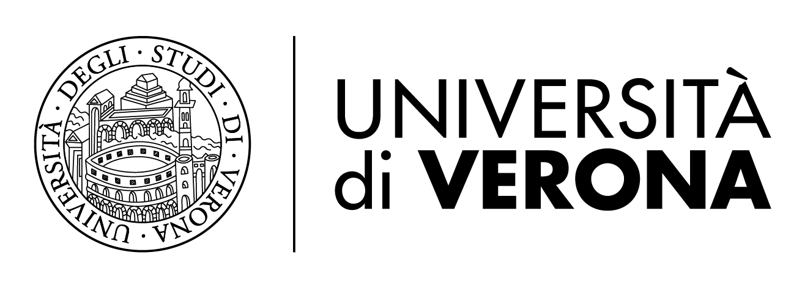

# Codificare, Analizzare, Diffondere: <br />Le Digital Humanities nei progetti dottorali

### Benvenuta/o!
Qui troverai tutte le informazioni relative alla scuola estiva CAD 2019. 


### <a name="menu"></a>Menù 
<!--using <a> anchor in header to work-around grave accent issue in markdown anchor-->

* [Introduzione](#introduzione)
* [Informazioni organizzative](#informazioni-organizzative)
* [Requisiti](#requisiti)
* [Iscrizioni](#iscrizioni)
* [Programma](#programma)
* [Contattaci](#contattaci)
* [Ringraziamenti](#ringraziamenti)

<!--* [Materiali](#materiali)
* [Approfondimento](#approfondimento)
* [Feedback](#feedback)-->

* * * 


## Introduzione

L’uso dell’**informatica nelle ricerche umanistiche** è oggigiorno sempre più importante e si presenta come un dibattito attuale e cruciale nell’**innovazione scientifica**. Si assiste infatti ogni anno alla crescita del numero di specialisti e ricercatori che decidono di impegnarsi nell’uso degli **strumenti digitali** nelle loro ricerche **linguistiche, letterarie, storiche, geografiche** ecc.
Considerando l’estrema attualità di questi strumenti e l’ottima **integrazione** che dimostrano con le metodologie d’analisi tipiche delle discipline umanistiche, pare opportuno prevedere una formazione specifica per **dottorandi in italianistica** che non abbiano ancora avuto l’opportunità di conoscere le **potenzialità** dell’informatica e l’**impatto** che potrebbe avere sui loro progetti di tesi. 

La filosofia di questa scuola è mettere al centro il **testo**, secondo la filosofia tipica delle Digital Humanities: **Codificare, Analizzare e Diffondere**. 

In questi tre giorni si vogliono fornire ai partecipanti un **panorama bibliografico**, degli **strumenti pratici** e delle **indicazioni per la formazione**, da consultare in seguito, per approfondire le competenze utili ad ognuno, con una coscienza critica di cosa è necessario per fare cosa. ll **principale scopo** della formazione proposta è **domandare direttamente ai dottorandi cosa fanno, per suggerire cosa potrebbero fare**. 


#### Comitato scientifico-organizzativo 

* **Dott. Giovanni Pietro Vitali** – University College Cork
* **Dott.ssa Greta Franzini** – Università Cattolica del Sacro Cuore (Milano)
* **Dott. Simon Gabay** – Université de Neuchâtel
* **Dott.ssa Elena Spadini** - Université de Lausanne
* **Dott. Simone Rebora** – Università di Verona e Georg-August-Universität Göttingen


READ MORE... (link alla full page con maggiori dettagli su tutti i punti di cui sopra + borse ecc.)


## Informazioni organizzative

<dl>
<dt>Data</dt>
<dd>16-19 luglio 2019</dd>
<dt>Luogo</dt>
<dd>Università di Verona, Polo Santa Marta, via... [MAPPA LINK]</dd>
<dt>Locandina pubblicitaria</dt>
<dd>Scaricala da <a href="https://github.com/CADottorato/sito/blob/master/assets/img/CAD-locandina.jpg" target="_blank" title="Opens in new tab">qui</a> (318 KB)</dd>
<dt>Social</dt>
<dd>Segui la nostra <a href="https://bit.ly/2P0CikQ" target="_blank" title="Opens in new tab">pagina Facebook</a> e/o l'hashtag di Twitter (LINK)</dd>
</dl>

<!--
<dt>Aule</dt>
<dd>....</dd>
<dt>Cena sociale</dt>
<dd>Ristorante ...</dd>-->


## Requisiti


## Iscrizioni

*Attenzione!* La registrazione non è una conferma di iscrizione. I dossier saranno valutati e tutti coloro che hanno completato la registrazione riceveranno una conferma di accettazione o ricusa entro febbraio 2019. I criteri per la valutazione sono la completezza del dossier e la varietà delle provenienze (saranno privilegiati candidati di diverse università rispetto a più candidati della stessa università); il progetto di tesi in sé non è sottoposto ad alcuna valutazione. La selezione è volta ad assicurare che il numero dei partecipanti non sia troppo elevato, a discapito della qualità della formazione.


#### Come iscriversi

Scarica il formulario per l'iscrizione [qui](docs/iscrizioni_form.rtf).

La richiesta di iscrizione deve contenere un dossier con:

* una breve presentazione della tesi di dottorato, che ne evidenzi obiettivi di ricerca e metodologia (max 600 parole);
* una breve presentazione su come pensi usare le Digital Humanities nel tuo progetto di ricerca, corredata da tre domande (max 400 parole);
* (opzionale) se già disponibile, un dataset che vorresti trattare con metodi digitali.


Formulario e dossier devono essere inviati in un **unico file** all'indirizzo XXXXXXX. Formati accettati sono `.rtf`, `.odt`, `.docx`, `.pdf`.

#### Informazioni importanti

Il **nome** del file deve essere `dossier_CognomeNome`, ad esempio `dossier_RossiMario`.

L'eventuale **dataset** deve essere inviato a parte e può essere composto da file (NO `.pdf`; SI `.txt`, `.xml`, `.odt`, `.docx`, `.rtf`, `.ttl`, `.sql`, ecc.) contenenti testi, date, luoghi, immagini, ecc. Più il dataset è ordinato e strutturato, meno preparazione richiederà per essere trattato. Il dataset può essere composto da un unico file o da più file riuniti in una cartella `.zip`. Il file o la cartella `.zip` deve chiamarsi `dataset_CognomeNome`, ad esempio `dataset_VerdiMaria`.


<!--## Programma

### Martedì 16 luglio

| Ore          | Sessione          | Formatore  | Aula |
|:-------------|:------------------|:-----------|:-----|
| 09:00-10:00  | Stilometria       | S. Rebora  |      |
| 11:00-11:30  | PAUSA CAFFE'      |            |      |


### Mercoledì 17 luglio - *Codificare*


| Ore          | Sessione          | Formatore    | Aula |
|:-------------|:----------------|:---------------|:-----|
|              |                 |                |      |


### Giovedì 18 luglio - *Analizzare*

| Ore       | Sessione         | Formatore | Aula   |
|:----------|:-----------------|:----------|:-------|
|           |                  |           |        |


### Venerdì 19 luglio - *Diffondere*

| Ore        | Sessione        | Formatore | Aula |
|:-----------|:----------------|:----------|:-----|
|            |                 |           |      |

## Materiali


### Segnala problemi 

Per segnalare problemi o la presenza di refusi nei materiali didattici, crea un nuovo *issue* [QUI](https://github.com/CADottorato/materiali/issues).


## Approfondimento

* GitHub
* Stilometria
* Ecc.

## Feedback

Come valuteresti la tua esperienza a CAD?
Aiutaci a migliorare scrivendo a ....-->


## Contattaci

Per qualsiasi dubbio, problema, domanda, scrivici al seguente indirizzo: INDIRIZZO.


## Ringraziamenti

AIPI, AIUCD, Profs di UniVR, ecc.

<br/><br />
### [Torna al men&#249; &uarr;](#menu)


* * *

<p align="center">
  <a href="http://www.aiucd.it" target="_blank" title="Opens in new tab"></a> &nbsp;&nbsp;&nbsp;&nbsp;
  <a href="http://www.infoaipi.org/" target="_blank" title="Opens in new tab"></a> 
</p>





<!--

Text can be ~~strikethrough~~.

[Link to another page](./another-page.html).


```js
// Javascript code with syntax highlighting.
var fun = function lang(l) {
  dateformat.i18n = require('./lang/' + l)
  return true;
}
```

```ruby
# Ruby code with syntax highlighting
GitHubPages::Dependencies.gems.each do |gem, version|
  s.add_dependency(gem, "= #{version}")
end
```-->
