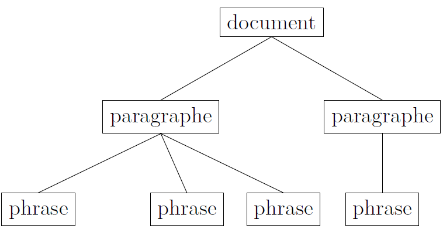

Scuola estiva CADottorato

# TEI (prima parte): un primo testo

Simon Gabay
Verona, 17 luglio 2019

---
## XML
---

### XML
XML significato _Extensible Markup Language_. È un linguaggio di markup (vs linguaggio di programmazione, data definition language, linguaggio di interrogazione). Come tutte le lingue, è regolato da norme.

Cf. [Wikipedia](https://it.wikipedia.org/wiki/XML)

---

### Le regole principali

Questo linguaggio di markup funziona in modo semplice
```XML
    <elemento attributo="valore">data/testo</elemento>
```
1. Un ```<elemento>``` inizia e finisce con dei caporali
2. Un ```<elemento>``` (o tag) è seguito da un ```</elemento>``` di chiusura
3. Un ```<elemento1>``` non deve  ```<elemento2>``` essere incrociato ```</elemento1>``` con un altro ```</elemento2>```
4. Un ```<elemento/>``` può autochiudersi
5. Un ```<elemento>``` potrebbe avere un @attributo (segnalato da una ```@```)
6. Un ```@attributo``` ha un ```"valore"``` (tra virgolette)

---

### Dal testo al database

1. I dati sono racchiusi tra due tag, che corrispondono a capitoli, paragrafi, frasi, parole, caratteri ...
2. I dati sono "incastrati" l'uno nell'altro: un documento contiene paragrafi, che contengono frasi, che contengono parole ...


3. Questo trasforma il testo in un database.

---

### Una struttura arborea

Esempio:

>We use a priori italics for words borrowed from other languages. We use small capitals for proper nouns, like Jean-Pierre Vitali. We use bold for other reasons.
We use a carriage return for a new paragraph.

Struttura sottostante:



---

### XML come un languaggio struturatto

```XML
<documento>
  <paragrafo>
    <frase>
      We use <LocuzioneStraniera>a
      priori</LocuzioneStraniera> italics for
      words borrowed from other languages.
    </frase>
    <frase>
    We use small capitals for proper nouns, like
    <nome>Jean-Pierre Vitali</nome> or
    <nome>Brad Pitt</nome>.
    </frase>
    <frase>
      We use bold for other reasons.
    </frase>
  </paragrafo>
  <paragrafo>
    <frase>
      We use a carriage return for a new paragraph.
    </frase>
  </paragrafo>
</documento>
```
---

### Una domanda fondamentale

1. Abbiamo usato qui ```<paragrafo>``` o ```<frase>```, ma avremmo potuto scegliere altri etichette.
2. Se fossimo francesi, avremmo scelto ```<paragraphe>``` e ```<phrase>```
3. Ma se avessimo fatto così, non riusciremmo a farci capire da tutti. Come scegliere nomi per gli ```<elementi>``` e gli ```@attributi``` che siano comuni a tutti?

---
## TEI
---

### La TEI

- TEI significa _Text Encoding Initiative_
- È stato creato nel 1987 (quindi prima di Internet)
- Il TEI è guidato da un consorzio che mantiene e sviluppa consigli (_guidelines_) per la codifica dei testi
- Queste consigli sono in continua evoluzione
- Sono disponibili online a questo indirizzo [http://www.tei-c.org/guidelines/](http://www.tei-c.org/guidelines)

---

### Tra vocabolario e linguaggio

Ci vocabolari XML oltre a la TEI, come ad esempio:
- EAD (_Encoded Archival Description_) per gli archivisti
- lDC (_Dublin Core_) per i bibliotecari
- TMX (_Translation Memory eXchange_) per i traduttori

Questi vocabolari possono anche essere espressi con altre linguaggi (come RDF-DC in turtle).

Per questo motivo, stiamo parlando di XML-TEI, (quindi c'era un SGML-TEI).

---

### Tre peculiarità della TEI

1. Il vocabolario è in inglese: usiamo un tag ```<w>``` (_word_) per una ```<w>parola</w>```
2. È limitato: non possiamo inventare, o quasi, nuovi elementi o attributi
3. Propone una codifica semantica (a differenza di LaTeX, ad esempio)

---

### Semantico e procedurale

>We use a priori italics for words borrowed from other languages.

Procedurale

```XML
We use <corsivo>a priori</corsivo> italics for words borrowed
from other languages.
```
Semantico

```XML
We use <locuzioneStraniera>a priori</locuzioneStraniera> italics for
words borrowed from other languages.
```
Semantico II
```XML
We use <latino>a priori</latino> italics for
words borrowed from other languages.
````

---

### In TEI

```XML
We use <foreign xml:lang="la">a priori</foreign> italics for
words borrowed from other languages.
```

---

# Alcuni concetti

---

### Modellazione

> Opération par laquelle on établit le modèle d’un système complexe, afin d’étudier plus commodément et de mesurer les effets sur ce système des variations de tel ou tel de ses éléments composants.

J. Giraud, P. Pamart, J. Riverain, _Les nouveaux mots «dans le vent»_, Paris, France, 1974.

Si tratta di definire un modello adatto:
1. ai documenti che sono pubblicati
2. alle nostre domande di ricerca
3. ai mezzi (tecnici, finanziari...) disponibili

Attenzione! Spesso è costoso e complicato tornare su certe scelte.

---

### La modellizzazione per un filologo

In termini concreti, per un filologo, le prime domande sono:
- Quali passaggi di testo dovrebbero essere etichettati? I nomi? frasi straniere? tutte le parole? Dovremmo inserire la categoria morfo-sintattica e il lemma?
- Dovremmo rappresentare la struttura fisica del documento (fogli, pagine ...) o la struttura logica (capitoli, parti ...)

Attenzione, è (quasi) impossibile fare tutto: si deve scegliere!

---

### Modellisazione: struttura logica
```XML
<documento>
  <paragrafo>
    <frase>
      We use a priori italics for words
      borrowed from other languages.
    </frase>
    <frase>
      We use small capitals for proper nouns,
      like Jean-Pierre Vitali or Brad Pitt.
    </frase>
  </paragrafo>
</documento>
```


---

### Modellisazione: struttura fisica

```XML
<documento>
  <pb n="1"/>
    We use a priori italics for words
    borrowed from other languages. We
  <pb n="2"/>
    use small capitals for proper nouns,
    like Jean-Pierre Vitali or Brad Pitt.
</documento>
```

---

### Granularità
> Grado di precisione di un modello, concepito sulla la base della più piccola delle sue componenti. Maggiore è la granularità, più si scende nella modellazione dei dati (livello della frase, della parola, del grafema, ecc.) e più etichette vengono aggiunte.

---

Granularità bassa
```XML
<documento>
  <paragrafo>
    <frase>
      We use a priori italics for words
      borrowed from other languages.
    </frase>
    <frase>
      We use small capitals for proper nouns,
      like Jean-Pierre Vitali or Brad Pitt.
    </frase>
  </paragrafo>
</documento>
```

---

Granularità media
```XML
<documento>
  <paragrafo>
    <frase>
      We use <locuzioneStraniera>a priori</locuzioneStraniera> italics
      for words borrowed from other languages.
    </frase>
    <frase>
      We use small capitals for proper nouns, like
      <nome>Jean-Pierre Vitali</nome> or <nome>Brad Pitt</nome>.
    </frase>
  </paragrafo>
</documento>
```

---

Granularità alta
```XML
<documento>
  <paragrafo>
    <phrase>
      <w lemma="we" POS="PRO">We<w/>
      <w lemma="use" POS="VER">use<w>
     ...
```

---
### Esercizi

cf. [qui](https://github.com/gabays/Cours_Nancy_2019/tree/master/TEI_1/TEI_1_exo)

---
### Sources

Questo corso riprende parte di un corso tenuto con J.-B. Camps a Neuchâtel nel febbraio 2018.
